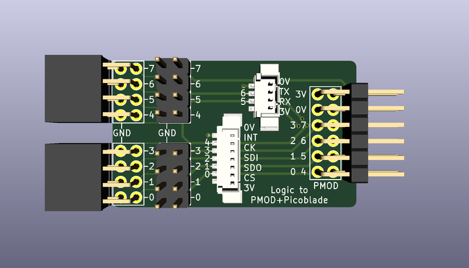
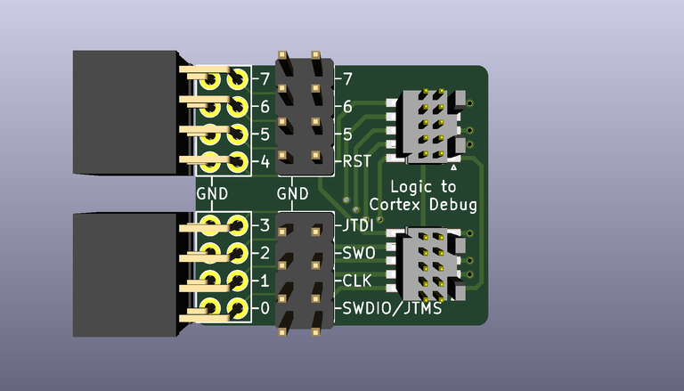

# Adapter PCBs for Saleae Logic

## PMOD + Picoblade

Connects a Saleae Logic or other logic analyser to a double-PMOD socket header
and to two Picoblade connectors, one 4-pin and one 7-pin.

## Cortex Debug

Connects a Saleae Logic or other logic analyser to two Cortex Debug 2x5 0.05"
connectors which are connected together, allowing analysis of signals between
a debugger and a target.

